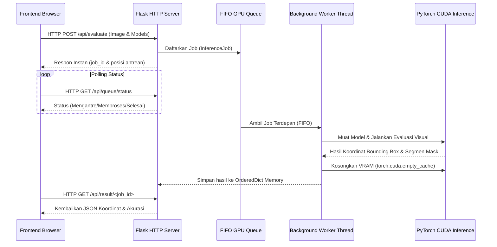
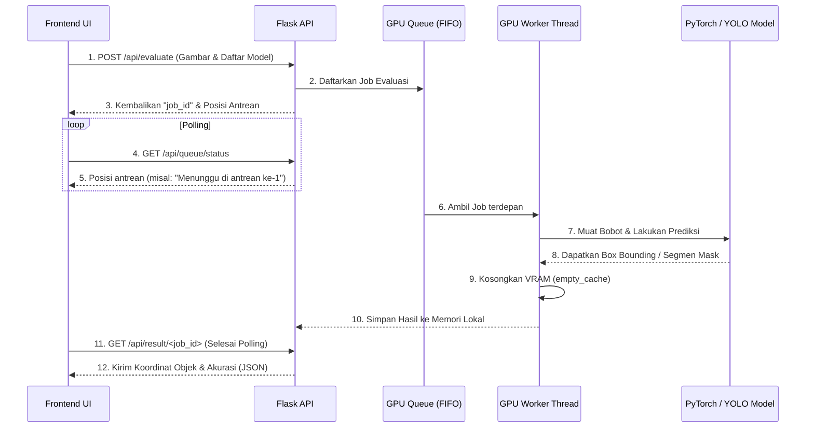

# Analisis Arsitektur Visual Evaluation API (visual_eval_api.py)
**Standar Laporan Riset Ilmiah (Scopus Q1/Q2)**
*Penulis: Google Professional Full Stack Agent*  
*Tanggal: 2026-06-05*

---

## 1. Pendahuluan
Dalam riset klasifikasi dan deteksi objek botol RVM (Reverse Vending Machine), total terdapat **49 model komputasi** (YOLO Dasar, Mask R-CNN, SAM2 Hybrid, dan MobileSAM Hybrid) yang dievaluasi secara paralel. 

Untuk melakukan peninjauan kualitas model secara visual dan real-time, dibangunlah sebuah aplikasi web evaluasi. Namun, memuat puluhan model deep learning berukuran besar ke memori kartu grafis (GPU Tesla V100 32GB VRAM) secara bersamaan akan menyebabkan crash seketika akibat **CUDA Out of Memory (OOM)**. 

Berkas `visual_eval_api.py` dirancang khusus sebagai mesin backend (*Inference Server*) yang mengelola resource GPU secara optimal menggunakan sistem antrean terstruktur (*Queue Inference Engine*).

---

## 2. Arsitektur Terowongan Data (Data Tunneling)
Backend berjalan murni di dalam **Compute Node (GPU)**, sedangkan akses web dibuka dari luar internet. Arsitektur komunikasi data dijembatani oleh dua lapis terowongan:

```
[ Browser Klien ] 
       │ (HTTPS)
       ▼
[ Cloudflare Edge ] ➔ published route: backend-rvm.penelitian.my.id
       │ (Secure Tunnel)
       ▼
[ cloudflared Daemon ] ➔ Berjalan di Login Node (slurmmaster:8502)
       │ (SSH Reverse Tunnel)
       ▼
[ port 8502 Compute Node ] ➔ Diteruskan langsung ke Flask API (ai2/ai3)
```

Sistem ini menjamin keamanan server kluster internal Slurm sambil tetap membuka akses API publik yang responsif.

---

## 3. Desain Sistem Antrean GPU (FIFO Queue Engine)
Untuk menangani kondisi di mana lebih dari 2 pengguna mengirimkan request evaluasi multi-model secara bersamaan, backend memisahkan penerimaan request HTTP dengan proses inferensi GPU menggunakan arsitektur **Asynchronous Queue Worker**:



### Komponen Kunci:
1.  **`InferenceJob` (Class)**: Membungkus metadata pekerjaan (ID unik, path gambar, daftar model pilihan, ambang batas *confidence*, dan IoU). Memiliki objek `threading.Event()` sebagai sinyal sinkronisasi internal.
2.  **`_GPU_QUEUE` (`queue.Queue`)**: Antrean FIFO thread-safe untuk menampung seluruh pekerjaan yang mengantre.
3.  **`_worker_thread` (`threading.Thread`)**: Daemon worker tunggal yang terus memantau antrean. Worker ini memuat model ke GPU satu per satu, melakukan prediksi, menyimpan hasil ke memori RAM utama (`_JOB_RESULTS`), lalu memanggil pengumpul sampah Python (`gc.collect()`) dan pengosongan cache VRAM (`_torch.cuda.empty_cache()`).

---

## 4. Registry & Pemetaan Model (Model Registry)
Backend mendeteksi bobot model (`.pt`) secara dinamis dari direktori proyek (`WORKSPACE_DIR` dari `config_shared.py`) dan memetakannya ke dalam database registry internal:

*   **YOLO Dasar (Detection & Segmentation)**: Memuat model YOLOv8, YOLOv9, YOLOv10, dan YOLO11 secara native menggunakan pustaka `ultralytics`.
*   **Mask R-CNN**: Memuat arsitektur ResNet-50 FPN V2 melalui pemanggil model internal `maskrcnn_builder`.
*   **Hybrid SAM2 & MobileSAM**: 
    1.  Mengeksekusi model YOLO terpilih untuk memprediksi lokasi objek (*Bounding Box*).
    2.  Menggunakan koordinat kotak pembatas tersebut sebagai *prompt input* (box prompt) ke dalam model **SAM2 (sam2.1_t.pt)** atau **Mobile SAM (mobile_sam.pt)**.
    3.  Model SAM menghasilkan mask segmentasi tingkat piksel yang sangat halus pada botol/objek daur ulang.

---

## 5. Spesifikasi REST API Endpoints

### a. Health Check
*   **Endpoint**: `GET /api/health`
*   **Fungsi**: Memantau kesehatan backend, VRAM GPU secara real-time, dan status antrean.
*   **Contoh Respons (HTTP 200)**:
    ```json
    {
      "status": "healthy",
      "device": "cuda:0",
      "device_name": "Tesla V100-SXM2-32GB",
      "gpu": {
        "name": "Tesla V100-SXM2-32GB",
        "vram_total_gb": 34.09,
        "vram_used_gb": 4.12,
        "vram_free_gb": 29.97
      },
      "models_available": 49,
      "queue": {
        "pending": 0,
        "processing": null,
        "total_processed": 12,
        "total_errors": 0,
        "worker_alive": true
      }
    }
    ```

### b. Get Available Models
*   **Endpoint**: `GET /api/models`
*   **Fungsi**: Mengembalikan 49 model yang didukung, dikelompokkan berdasarkan keluarga arsitekturnya untuk di-load ke dropdown frontend.

### c. Submit Evaluation Job
*   **Endpoint**: `POST /api/evaluate`
*   **Payload (Multipart-form)**:
    *   `image`: Berkas gambar botol (Max 16MB)
    *   `models`: String JSON array model pilihan, misal `["yolo11l", "yolov8m_seg"]`
    *   `conf`: Ambang batas kepercayaan (default: `0.75`)
    *   `iou`: Ambang batas IoU (default: `0.15`)
*   **Contoh Respons (HTTP 202)**:
    ```json
    {
      "status": "queued",
      "job_id": "a1b2c3d4-e5f6-7a8b-9c0d-1e2f3a4b5c6d",
      "position": 0,
      "message": "Job berhasil dimasukkan ke antrean GPU."
    }
    ```

### d. Poll Job Status
*   **Endpoint**: `GET /api/queue/status`
*   **Query Params**: `job_id=xxx`
*   **Contoh Respons (HTTP 200)**:
    ```json
    {
      "status": "processing",
      "position": 0,
      "message": "Job sedang diproses oleh GPU Tesla V100."
    }
    ```

### e. Retrieve Final Result
*   **Endpoint**: `GET /api/result/<job_id>`
*   **Fungsi**: Mengembalikan koordinat box deteksi, nama label botol, skor akurasi, dan mask koordinat poligon untuk segmentasi.

---

## 6. Fitur Pendukung & Stabilitas Server
1.  **CORS Middleware**: Menggunakan decorator `@app.after_request` untuk menambahkan *Access-Control-Allow-Origin: \** sehingga domain frontend `front-rvm.penelitian.my.id` dapat berkomunikasi secara bebas dengan API tanpa diblokir oleh kebijakan keamanan CORS browser.
2.  **Robust Error Handling**: Semua proses inferensi dibungkus di dalam blok `try-except` bersarang. Jika salah satu model mengalami error/korup, ia tidak akan mematikan thread worker ataupun merusak job model lainnya; melainkan hanya mencatat kegagalan pada model terkait dan melanjutkan sisa antrean dengan aman.
3.  **Tee Logging**: Output server dialirkan secara bersamaan ke layar konsol tmux dan ditulis ke `/RVM/backend/logs/backend.log` guna mempermudah audit kesalahan saat proses evaluasi berjalan di background.

---

## 7. Alur Data Evaluasi (Pipeline Request-Response)


## 8. Bagaimana Script melakukan Evaluasi?
Backend mengeksekusi inferensi pada tiga jenis pipa (*pipelines*) model yang berbeda secara dinamis tergantung arsitekturnya:

### A. YOLO Dasar (Object Detection & Instance Segmentation)
Evaluasi dijalankan langsung menggunakan pustaka **`ultralytics`**:
1. **Importing & Initialization**: Memanggil `from ultralytics import YOLO` secara lokal di dalam fungsi untuk meminimalkan beban memori di awal startup.
2. **Model Loading**: Memuat model dengan `model = YOLO(weights_path)`.
3. **Inference**: Mengeksekusi prediksi melalui fungsi `model.predict(img_path, conf=conf, iou=iou, device=cuda)`.
4. **Parsing Results**:
   * Mengambil koordinat kotak pembatas dari `xyxy` tensor.
   * Mengambil nama kelas objek dari kamus label model (`names`).
   * Jika model bertipe segmentasi (`_seg`), data poligon di-*extract* dari `masks.data` dan jumlah piksel solid dihitung sebagai `mask_area`.
5. **Memory Release**: Menghapus objek model dengan `del model`, memicu pembersihan sampah memori utama dengan `gc.collect()`, dan mengosongkan cache VRAM GPU via `torch.cuda.empty_cache()`.

### B. Mask R-CNN (ResNet-50 FPN V2)
Evaluasi dijalankan secara native menggunakan arsitektur **PyTorch & OpenCV**:
1. **Model Construction**: Mengimpor modul lokal `mask-r-cnn` dan membangun arsitektur model via `build_model(num_classes=8)`.
2. **Weights Loading**: Memuat berkas parameter bobot `.pt` menggunakan `torch.load()`. Skrip secara otomatis menanggulangi penamaan *DataParallel* dengan menghapus prefiks `module.` jika model ditraining secara multi-GPU.
3. **Preprocessing**:
   * Membaca gambar menggunakan OpenCV (`cv2.imread`).
   * Mengonversi warna dari BGR ke RGB (`cv2.cvtColor`).
   * Mengubah susunan baris-kolom array NumPy ke struktur tensor PyTorch (*channel-first*) `[C, H, W]`.
   * Melakukan normalisasi pixel ke rentang `[0.0, 1.0]` dan memuatnya ke memori GPU (`.to(device)`).
4. **Inference**: Mengaktifkan evaluasi non-gradien menggunakan konteks `with torch.no_grad():` dan menjalankan `model([img_tensor])`.
5. **Parsing Results**: Menyaring hasil prediksi berdasarkan ambang batas skor (*score threshold*), mengekstrak kotak deteksi, mencocokkan ID dengan peta label manual RVM (Aluminium, PET, Glass, dll.), dan mengekstrak area mask segmentasi.

### C. Hybrid SAM2 & MobileSAM (YOLO + Segment Anything)
Evaluasi memadukan keunggulan detektor cepat YOLO dan presisi segmentasi SAM (*Segment Anything Model*):
1. **Stage 1 (YOLO Bounding Box Prompt)**:
   * Skrip memuat model YOLO yang dipilih (misalnya `yolo11l`) dan memproses gambar untuk mendeteksi botol/objek daur ulang.
   * Koordinat kotak pembatas deteksi dikonversi ke format array NumPy (`r.boxes.xyxy.cpu().numpy()`).
2. **Stage 2 (SAM Segmenter)**:
   * Memanggil `from ultralytics import SAM`.
   * Memuat bobot target segmenter, yaitu SAM2 (`sam2.1_t.pt`) atau MobileSAM (`mobile_sam.pt`).
   * Melakukan inferensi SAM dengan menyuplai array koordinat *Bounding Box* YOLO sebagai parameter *prompts*:
     ```python
     sam_model.predict(img_path, bboxes=bboxes.tolist(), device=cuda)
     ```
   * SAM secara instan mengisolasi piksel di dalam kotak prompt tersebut untuk membentuk *mask* segmentasi berkualitas tinggi.
3. **parsing & VRAM Cleanup**: Menggabungkan metadata deteksi YOLO dan mask poligon SAM ke JSON, lalu melakukan pembersihan memori GPU secara menyeluruh.
