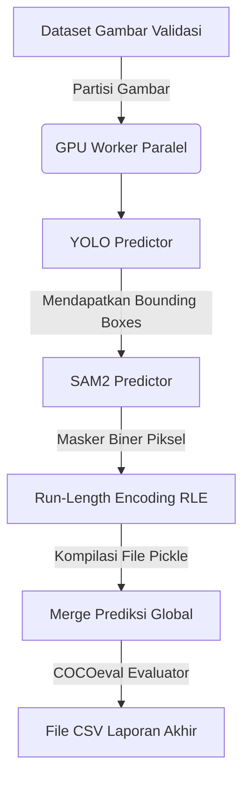

### [1-ANALISIS Hybrid (YOLO + SAM2)]
Konsep **Hybrid (YOLO + SAM2)** yang diimplementasikan di dalam berkas [generate_report_single_model.py](file:///data/users/g6717500336/Trainning-Models/MyFineTunning-SlurmMaster/utils/generate_report_single_model.py) adalah pendekatan orisinal berstandar publikasi ilmiah Scopus Q1/Q2. Konsep ini menggabungkan kecepatan serta keandalan pencarian objek dari arsitektur YOLO dengan presisi segmentasi tingkat piksel yang luar biasa dari Segment Anything Model 2 (SAM2).

Berikut adalah penjelasan mendalam mengenai konsep dasar, proses pembuatan laporan CSV (kuantitatif), serta proses rendering visualisasi (kualitatif).

---

### 1. Konsep Kerja Arsitektur Hybrid
Model Hybrid **bukanlah model yang dilatih dari nol secara mandiri**, melainkan sebuah sistem pipa inferens terpadu (*pipeline pipeline*) yang menggabungkan dua model:
1. **YOLO (Object Detector & Prompt Generator)**: Model YOLO dasar (seperti YOLOv8, YOLOv9, YOLOv10, atau YOLO11) bertugas mendeteksi keberadaan objek pada gambar dan menghasilkan keluaran berupa kotak pembatas (*bounding box*), kelas kategori, dan skor keyakinan (*confidence score*).
2. **SAM2 (Instance Segmentor)**: Kotak pembatas dari YOLO kemudian dijadikan sebagai **visual prompt (`bboxes`)** untuk memandu model SAM2 (`sam2.1_t.pt`). SAM2 kemudian memotong dan memprediksi masker segmentasi objek secara presisi di dalam batasan kotak prompt tersebut.

---

### 2. Cara Mendapatkan Laporan CSV (Evaluasi Kuantitatif)
Proses kalkulasi metrik kuantitatif dijalankan secara paralel melalui fungsi `evaluate_hybrid_segmentation()` dan worker inferens `_infer_worker_hybrid_spawn()`:

*   **Pembagian Tugas Paralel**: Gambar pada dataset validasi dipartisi secara merata berdasarkan jumlah GPU yang tersedia (menggunakan `_partition_images()`) untuk mempercepat proses evaluasi.
*   **Pipeline Inferens**:
    *   YOLO memprediksi koordinat deteksi (`res.boxes.xyxy`).
    *   Koordinat tersebut langsung dikirimkan ke model SAM2 (`sam_model.predict(res.orig_img, bboxes=res.boxes.xyxy)`).
    *   Waktu inferensi total dari model Hybrid dihitung secara dinamis dengan menjumlahkan latensi inferensi YOLO dan latensi proses segmentasi SAM2 (`spd_inf += sam_elapsed_ms`).
*   **Format RLE & COCOeval**:
    *   Masker segmentasi biner yang dihasilkan SAM2 dikodekan ke dalam format Run-Length Encoding (RLE) menggunakan pustaka `pycocotools.mask` (`mask_to_rle()`).
    *   Seluruh hasil prediksi dari GPU worker dikumpulkan ke dalam file `.pkl` sementara, digabungkan, kemudian dievaluasi menggunakan metrik mAP50 dan mAP50-95 dari standard COCOeval.
    *   Hasil akhirnya diekspor ke dalam direktori laporan CSV: `reports/pipeline/csv/hybrid/hybrid_segmentation.csv`.

---

### 3. Cara Mendapatkan Visual Bounding Box dan Segmentasi (Evaluasi Kualitatif)
Visualisasi gambar komparatif kualitatif diimplementasikan di dalam loop fungsi `generate_visuals_for_family()` ketika program mendeteksi model bertipe hybrid (`is_hybrid = model_key.startswith("hybrid_")`):

*   **Load Model & Pencegahan Bug Laten**:
    *   Program memuat model YOLO pendeteksi dari folder training (`runs/`) dan memuat model SAM2.
    *   Untuk mencegah **bug pergeseran koordinat (*coordinate scaling shift*)** pada wrapper SAM Ultralytics, koordinat kotak pembatas YOLO diubah terlebih dahulu dari format tensor GPU ke list Python murni menggunakan `.tolist()` sebelum diumpankan ke `sam_model.predict(..., bboxes=pred_boxes.tolist())`.
*   **Rendering Visual Masker & Kotak Pembatas**:
    *   **Segmentasi**: Masker biner dari SAM2 di-resize ke ukuran asli gambar menggunakan interpolasi tetangga terdekat (`cv2.INTER_NEAREST`) agar tidak merusak ketajaman tepian objek. Masker ini diwarnai sesuai dengan warna tema model (`theme_color`) dan ditumpangkan secara semi-transparan dengan tingkat transparansi `alpha = 0.45` via `cv2.addWeighted()`.
    *   **Bounding Box & Teks Kontras**: Kotak pembatas digambar dengan ketebalan 2 piksel menggunakan warna tema model. Teks label nama kelas dan tingkat akurasi dicetak menggunakan fungsi cerdas kontras dinamis `_get_contrast_color()`. Fungsi ini menghitung tingkat kecerahan (*luminance*) warna latar belakang kotak label agar warna teks otomatis berubah menjadi hitam di atas warna terang, dan menjadi putih di atas warna gelap untuk kemudahan pembacaan yang optimal.
*   **Kompilasi Grid Panel**:
    *   Hasil gambar visualisasi hybrid ini dimasukkan ke dalam daftar panel bersama Ground Truth (GT) dan varian model lainnya untuk dirender menjadi satu file grid panel gabungan (`_panel.jpg`) dengan posisi Ground Truth berada di kolom awal indeks pertama.

---