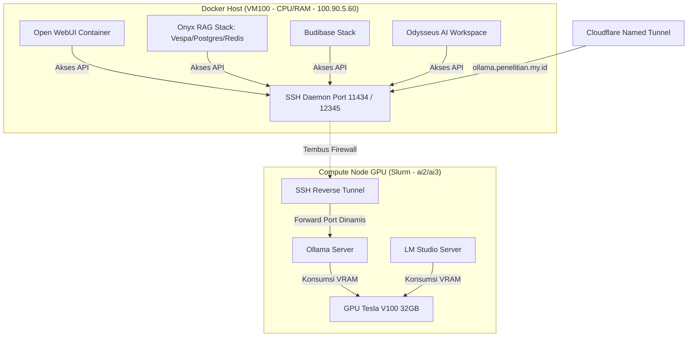

# Arsitektur Multi-Layanan LLM & Protokol Switching Aman (/data/users/g6717500336/singularity)

Rencana ini merancang infrastruktur terpadu untuk men-deploy, menjalankan, dan menguji 5 layanan LLM/Frontend (Ollama, LM Studio, Open WebUI, Onyx, Budibase, dan **Odysseus**) dengan membagi beban kerja secara cerdas antara **Compute GPU Node (Slurm)** dan **Docker Host (VM100)** tanpa mengotori folder pelatihan YOLO.

---

## 1. Arsitektur Distribusi Layanan

Untuk kinerja optimal, layanan dibagi menjadi dua kategori berdasarkan kebutuhan perangkat keras:



### A. GPU-Bound Services (Dijalankan di Slurm Node via Singularity/CLI)
*   **Ollama Server**: Menjalankan model kuantisasi secara efisien.
*   **LM Studio CLI Server**: Backend alternatif untuk inferensi model GGUF.

### B. CPU-Bound Services & Web UIs (Dijalankan di Docker Host VM100 via Docker Compose)
*   **Open WebUI**: Antarmuka ChatGPT-like.
*   **Onyx (Danswer)**: Enterprise RAG stack dengan parser dokumen, Vespa search engine, Postgres, dan Redis.
*   **Budibase**: Platform low-code untuk membuat dashboard internal.
*   **Odysseus**: Ruang kerja AI terintegrasi (Chat, Agen, Note-taking, Deep Research).

---

## 2. Struktur Direktori Kustom (`/data/users/g6717500336/singularity`)

```
/data/users/g6717500336/singularity/
├── cloudflared                   # Binary global Cloudflared
├── ollama/                       # Folder Layanan Ollama (Backend)
│   ├── ollama.sif
│   ├── setup_llm_service.sh
│   ├── sbatch_llm_service.sh
│   ├── models/                   # Folder penyimpanan model Ollama
│   └── logs/                     # Folder log Ollama & Tunnel
├── lm-studio/                    # Folder Layanan LM Studio (Backend)
│   ├── setup_lms.sh
│   ├── sbatch_lms.sh
│   ├── models/                   # Folder penyimpanan model LM Studio
│   └── logs/
└── open-webui/                   # Folder Open WebUI (Local Singularity Fallback)
    ├── open-webui.sif
    ├── setup_webui.sh
    └── logs/
```

*Catatan: Onyx, Budibase, dan Odysseus dideploy menggunakan Docker Compose langsung pada VM100 (`100.90.5.60`) karena arsitektur multi-containernya yang masif.*

---

## 3. Rencana Langkah Implementasi per Layanan

### Langkah 3.1: Inisialisasi Global & Cloudflared
Skrip setup awal akan mengunduh `cloudflared` ke folder `/data/users/g6717500336/singularity/` agar dapat diakses bersama.

### Langkah 3.2: Setup & Launching Backend GPU

#### A. Ollama Server
- Berkas setup: `/data/users/g6717500336/singularity/ollama/setup_llm_service.sh`
- Berkas launch: `/data/users/g6717500336/singularity/ollama/sbatch_llm_service.sh`

#### B. LM Studio CLI
- Berkas setup: `/data/users/g6717500336/singularity/lm-studio/setup_lms.sh`
  Mengunduh binary headless CLI LM Studio (`lms`) untuk Linux x86_64.
- Berkas launch: `/data/users/g6717500336/singularity/lm-studio/sbatch_lms.sh`
  Menjalankan server LM Studio CLI di GPU dengan parameter API OpenAI-compatible dan mengeksposnya via Cloudflared.

### Langkah 3.3: Setup Frontend / Aplikasi Web

#### A. Open WebUI (Diuji via Singularity di Slurm / Docker VM100)
- Kita sediakan skrip `/data/users/g6717500336/singularity/open-webui/setup_webui.sh` untuk mem-pull container dan menjalankannya secara lokal di Slurm jika diinginkan.
- Alternatifnya, pengguna dapat menjalankannya di VM100 dengan Docker satu baris.

#### B. Onyx, Budibase, dan Odysseus (Di-deploy di Docker Host VM100)
Kita sediakan petunjuk file `docker-compose.yml` terpisah di folder masing-masing pada VM100 agar dapat diaktifkan menggunakan Docker biasa tanpa limitasi Slurm.

**Petunjuk Deployment Odysseus di VM100:**
1. Kloning repositori resmi:
   ```bash
   git clone https://github.com/pewdiepie-archdaemon/odysseus.git /data/users/g6717500336/singularity/odysseus
   cd /data/users/g6717500336/singularity/odysseus
   ```
2. Buat berkas konfigurasi lingkungan:
   ```bash
   cp .env.example .env
   ```
3. Sunting berkas `.env` untuk menyambungkan ke endpoint API Ollama (lihat Protokol Switching di bawah).
4. Jalankan kontainer:
   ```bash
   docker compose up -d --build
   ```

---

## 4. Protokol Switching yang Aman & Isolasi Port

Switching antar layanan backend maupun frontend dilakukan menggunakan **OpenAI-Compatible API Endpoint**. Baik Ollama maupun LM Studio menyediakan endpoint API yang kompatibel dengan skema OpenAI.

### Cara Melakukan Switching Backend:

1.  **Jika Menggunakan Ollama**:
    - Jalankan job Slurm Ollama (`sbatch_llm_service.sh` atau via `book_gpu.py`).
    - Skrip akan otomatis mengikat port internal secara dinamis dan melakukan reverse SSH forwarding ke port `11434` di VM100.
    - Konfigurasikan Frontend (Open WebUI / Onyx / Budibase / Odysseus) dengan variabel lingkungan statis:
      ```env
      OPENAI_API_BASE_URL=https://ollama.penelitian.my.id/v1
      OPENAI_API_KEY=ollama
      ```
2.  **Jika Menggunakan LM Studio**:
    - Matikan job Slurm Ollama (`scancel <JOBID_OLLAMA>`).
    - Jalankan job Slurm LM Studio.
    - Skrip akan membuka reverse SSH forwarding ke port `12345` di VM100.
    - Ubah konfigurasi Frontend (Open WebUI / Onyx / Budibase / Odysseus) menjadi:
      ```env
      OPENAI_API_BASE_URL=https://lms.penelitian.my.id/v1
      OPENAI_API_KEY=lm-studio
      ```

### Aturan Keselamatan Switching (Mencegah CUDA OOM & Konflik Port):
1.  **Isolasi VRAM**: Jangan pernah menjalankan server Ollama dan server LM Studio pada saat yang bersamaan pada GPU Tesla V100 yang sama. Sebelum menyalakan salah satu, pastikan job Slurm backend lainnya telah dimatikan (`scancel`).
2.  **Isolasi Port**: Setiap launcher script (`sbatch`) menghasilkan port lokal acak secara dinamis (misal `18000-18999` untuk Ollama, `19000-19999` untuk LM Studio) sehingga tidak akan terjadi konflik port internal di compute node.

---

## 5. Verification Plan

### Automated Tests
- Menjalankan skrip inisialisasi lokal untuk memvalidasi pembuatan folder dan ketersediaan biner pendukung.

### Manual Verification
1.  Jalankan persiapan lingkungan global dan Ollama.
2.  Uji coba jalankan server Ollama, catat tunnel URL-nya.
3.  Jalankan Open WebUI, Onyx, Budibase, dan Odysseus secara berurutan di VM100, hubungkan ke tunnel URL tersebut.
4.  Lakukan uji coba obrolan dan manipulasi agen pada Odysseus.
5.  Matikan server Ollama, kemudian aktifkan server LM Studio. Ganti konfigurasi URL di semua frontend ke endpoint LM Studio. Verifikasi fungsionalitas obrolan.
