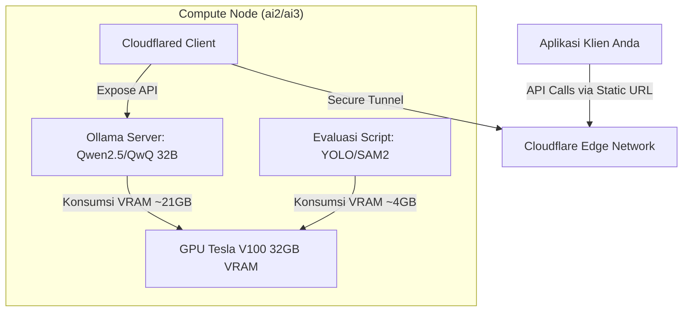

# 📋 Rencana Implementasi & Deployment Layanan LLM Berdampingan dengan Evaluasi YOLO (Co-existence Plan)

## 1. Latar Belakang & Analisis Sumber Daya (Resource Allocation)

Berdasarkan pembaruan parameter riset di mana alokasi GPU tidak lagi digunakan untuk proses Training intensif (hanya digunakan untuk proses Evaluasi model YOLO/SAM2 berskala kecil), kapasitas memori fisik pada satu GPU **Tesla V100 32GB** dapat dimanfaatkan secara optimal untuk menjalankan layanan LLM (*Large Language Model*) dan evaluasi model secara berdampingan (*co-existence*).

### Analisis Kebutuhan VRAM:
*   **Layanan LLM (Qwen2.5-32B / QwQ-32B INT4 via Ollama):** Membutuhkan memori sekitar **~20.5 GB hingga ~22.0 GB VRAM** untuk bobot model dan alokasi dasar KV Cache.
*   **Evaluasi Model YOLO/SAM2:** Membutuhkan alokasi memori sekitar **~3.0 GB hingga ~5.0 GB VRAM** (tergantung ukuran gambar dan model segmentasi).
*   **Total VRAM Gabungan:** Berkisar antara **~23.5 GB hingga ~27.0 GB VRAM**.
*   **Margin Keamanan:** Tersisa sisa memori sekitar **~5.0 GB hingga ~8.5 GB VRAM** pada GPU Tesla V100 32GB, yang menjamin kedua proses dapat berjalan bersamaan secara stabil tanpa memicu kesalahan *Out of Memory (OOM)*.

---

## 2. Arsitektur Sistem & Alur Kerja Terowongan (Tunneling)

Layanan LLM akan dideploy sebagai server background persisten di klaster Slurm, sedangkan eksekusi evaluasi YOLO/SAM2 dapat dipicu secara ad-hoc kapan saja pada node yang sama.



### Penanganan Batasan Waktu Slurm (Time Limit Mitigation):
Karena manajer Slurm membatasi *walltime* maksimum per job, server Ollama akan mati secara berkala. Untuk mengatasinya, diimplementasikan mekanisme **Graceful Auto-Rebooking** dengan memanfaatkan sinyal terminasi Slurm.

---

## 3. Rencana Langkah Implementasi

### Langkah 3.1: Konfigurasi Persistent Storage untuk Model
Sebelum menjalankan layanan, direktori model Ollama akan diarahkan ke penyimpanan persisten di direktori pengguna agar model 32B yang telah diunduh tidak terhapus saat sesi Slurm berganti:
```bash
export OLLAMA_MODELS="/data/users/g6717500336/.ollama/models"
```

### Langkah 3.2: Pembuatan Launcher Script Terotomatisasi (`sbatch_llm_service.sh`)
Skrip sbatch ini dirancang untuk:
1.  Meminta alokasi GPU normal via Slurm.
2.  Menangkap sinyal terminasi `SIGUSR1` dari Slurm 120 detik sebelum waktu habis.
3.  Mengirimkan ulang dirinya sendiri ke antrean (`sbatch`) sebelum dihentikan paksa, sehingga meminimalkan jeda waktu mati (*downtime*).

```bash
#!/bin/bash
#SBATCH --job-name=Ollama-Qwen32B
#SBATCH --gres=gpu:1
#SBATCH -p gpu
#SBATCH --cpus-per-task=4
#SBATCH --mem=32G
#SBATCH --time=04:00:00                # Waktu alokasi per sesi (misal 4 jam)
#SBATCH --signal=B:USR1@120            # Kirim sinyal USR1 2 menit sebelum habis

# 1. Konfigurasi Lingkungan
export OLLAMA_MODELS="/data/users/g6717500336/.ollama/models"
OLLAMA_PORT=$(shuf -i 18000-18999 -n 1)
export OLLAMA_HOST="127.0.0.1:${OLLAMA_PORT}"

# Fungsi penanganan sinyal terminasi
handle_termination() {
    echo "[WARN] Sinyal terminasi diterima! Menyiapkan kelanjutan layanan..."
    
    # Kirim ulang job sbatch ke antrean agar layanan berlanjut di sesi berikutnya
    sbatch "$0"
    
    # Matikan proses server secara rapi
    kill $OLLAMA_PID
    kill $CF_PID
    exit 0
}

# Daftarkan trap sinyal USR1
trap 'handle_termination' USR1

# 2. Jalankan Ollama Server (Singularity Container)
singularity exec --nv \
    --bind /data/users/g6717500336/.ollama:/root/.ollama \
    /data/users/g6717500336/containers/ollama.sif \
    ollama serve > logs/ollama_sbatch.log 2>&1 &
OLLAMA_PID=$!

sleep 5

# 3. Ekspos API via Cloudflared Tunnel
/data/users/g6717500336/programs/cloudflared tunnel \
    --url http://127.0.0.1:${OLLAMA_PORT} > logs/tunnel_sbatch.log 2>&1 &
CF_PID=$!

echo "[SUCCESS] Layanan LLM aktif pada port ${OLLAMA_PORT}"

# Tetap jalankan skrip agar trap sinyal Slurm dapat bekerja
wait $OLLAMA_PID
```

---

## 4. Strategi Mitigasi Risiko & Keamanan

| Potensi Risiko | Dampak | Strategi Mitigasi |
| :--- | :--- | :--- |
| **CUDA Out Of Memory (OOM)** | Proses evaluasi YOLO atau server Ollama crash tiba-tiba. | 1. Batasi ukuran KV Cache Ollama dengan mengatur parameter `OLLAMA_NUM_PARALLEL=1` di env variable.<br>2. Gunakan model kuantisasi INT4 yang stabil (~20.5 GB VRAM). |
| **Jeda Waktu saat Rebooking (Downtime)** | API tidak dapat diakses sementara saat job baru mengantre. | 1. Gunakan mekanisme `hold` / `requeue` jika memindahkan secara manual.<br>2. Cloudflared tunnel akan otomatis terhubung kembali ke alamat URL statis yang sama begitu job baru berjalan. |
| **Tabrakan Port di Node Komputasi** | Layanan gagal aktif karena port sedang digunakan oleh user lain. | Menggunakan generator port acak (`shuf -i 18000-18999 -n 1`) pada setiap inisialisasi awal skrip. |
